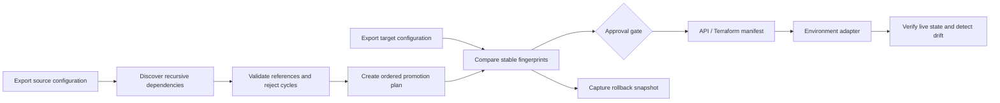
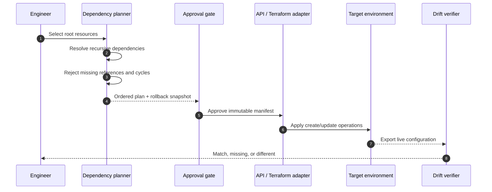

# CX-as-Code Deployment Automation Starter

[](https://github.com/3QInnova/cx-as-code-deployment-automation-starter/actions/workflows/ci.yml)

An original, platform-neutral reference implementation for promoting
interdependent contact-center and SaaS configuration safely across
Development, Disaster Recovery, and Production.

The engine discovers recursive dependencies, rejects missing references and
cycles, creates a deterministic deployment order, identifies creates and
updates, captures rollback state, exports a Terraform-ready manifest, and
verifies the resulting environment for drift.

## Why this pattern matters

Configuration-heavy platforms rarely consist of isolated objects. A workflow
may depend on prompts, queues, schedules, data tables, API actions, and shared
modules. Manual migration commonly misses those relationships, creates
environment drift, and encourages development directly in production.

This starter demonstrates the engineering pattern behind automation designed
for enterprise estates containing 1,000+ workflows and thousands of supporting
resources. It uses only synthetic examples and contains no employer, customer,
vendor-exported, or proprietary source code.

## What this demonstrates

- recursive dependency discovery and deterministic topological ordering;
- missing-reference and circular-dependency protection;
- create, update, and no-change classification;
- rollback snapshots for every changed target resource;
- immutable SHA-256 resource fingerprints and drift detection;
- selective promotion with automatic inclusion of shared dependencies;
- safe-by-default behavior with no implicit deletion;
- Terraform-ready, dependency-ordered manifest export;
- atomic JSON artifact writes;
- post-promotion verification against exported or live API state;
- automated tests and GitHub Actions continuous integration.

## Architecture



### Promotion lifecycle



## Quick start

Requires Python 3.12 or later.

```bash
python -m venv .venv
source .venv/bin/activate
python -m pip install .
```

Create a dependency-complete plan for one flow:

```bash
cxdeploy plan \
  --source examples/dev.json \
  --target examples/prod.json \
  --select flow:customer-service \
  --out build/promotion-plan.json
```

Export an ordered adapter manifest:

```bash
cxdeploy export-manifest \
  --source examples/dev.json \
  --select flow:customer-service \
  --out build/terraform-manifest.json
```

The generated manifest can be inspected with the platform-neutral Terraform
example:

```bash
terraform -chdir=terraform init
terraform -chdir=terraform plan \
  -var='promotion_manifest_file=../build/terraform-manifest.json'
```

Verify a post-deployment export:

```bash
cxdeploy verify \
  --expected examples/dev.json \
  --actual path/to/post-deployment-export.json \
  --select flow:customer-service
```

The verify command exits with status `2` when it finds missing or different
resources, making it suitable for a CI/CD gate.

## Adapter boundary

The repository deliberately stops before making vendor API calls. Production
implementations should translate each ordered manifest item through an approved
Terraform provider, REST API adapter, or SDK while preserving:

- sequence and dependency requirements;
- idempotency and stable resource mapping;
- per-environment authentication and authorization;
- retry and rate-limit policy;
- immutable plan, approval, and audit artifacts;
- post-deployment verification against live APIs.

See [SECURITY.md](SECURITY.md) for the required production controls.

## Test

```bash
python -m unittest discover -s tests -v
python -m compileall -q cxdeploy tests
```

The tests cover recursive discovery, deployment ordering, missing dependencies,
cycle detection, selective promotion, rollback capture, drift detection, and
safe preservation of target-only resources.

## Original public demonstration

This repository contains original demonstration code created for public use by
3QInnova LLC. It is inspired by broadly applicable production-engineering
patterns and does not contain employer, client, or proprietary source code.

## License

MIT
